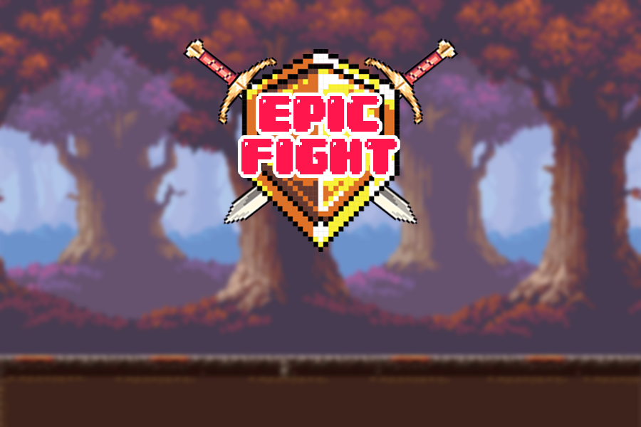

# Epic Fight

# **Epic Fight**

## **Descrição**

**Epic Fight** é um jogo platformer emocionante...

## Descrição
Epic Fight é um jogo platformer emocionante desenvolvido com as bibliotecas permitidas pgzero, random e o objeto React do pygame. O objetivo do jogo é simples: derrotar o boss enquanto navega por vários obstáculos e desafios.

## Recursos do Jogo
O jogo conta com as seguintes funcionalidades:

Tela de Início: Uma interface inicial que apresenta o jogo e suas opções.
Menu de Pausa: Permite que o jogador pause a música e os sons durante o jogo.
Animações de Sprites: Animações fluídas que trazem vida aos personagens e ao ambiente.
Objetivo: Derrote o boss para vencer o jogo.
Obstáculos: Enfrente desafios que podem eliminar o jogador.

#Instalação
Para instalar e jogar Epic Fight, siga as instruções abaixo:

## Instale o Pygame Zero:
- pip install pgzero

## Inicie o Jogo:

Execute o seguinte comando no terminal:
- pgzrun intro.py
